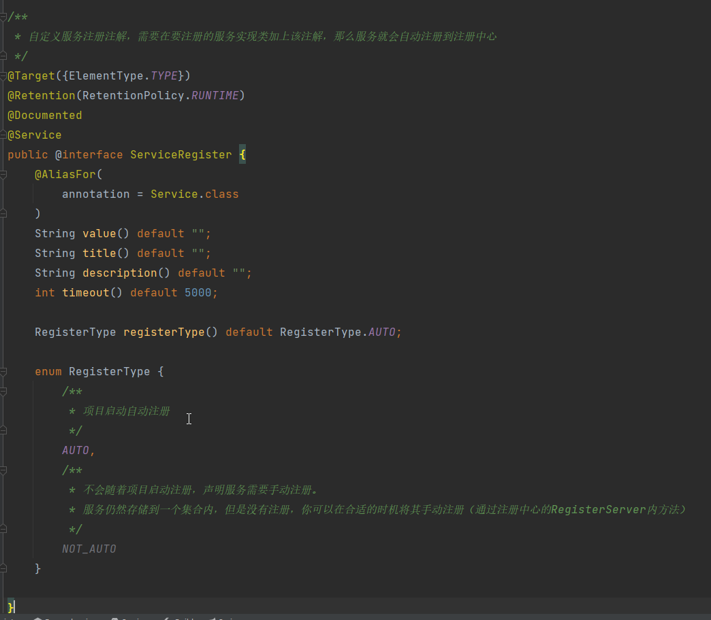
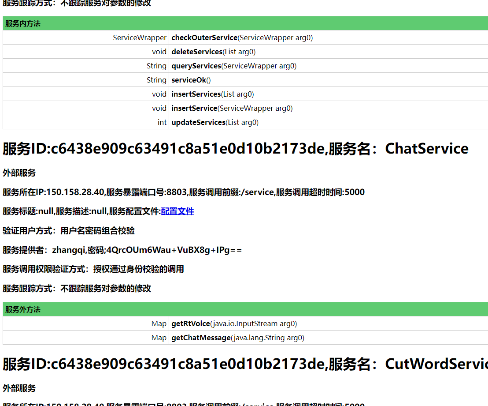
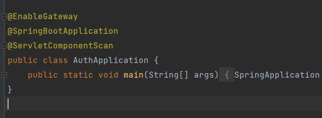
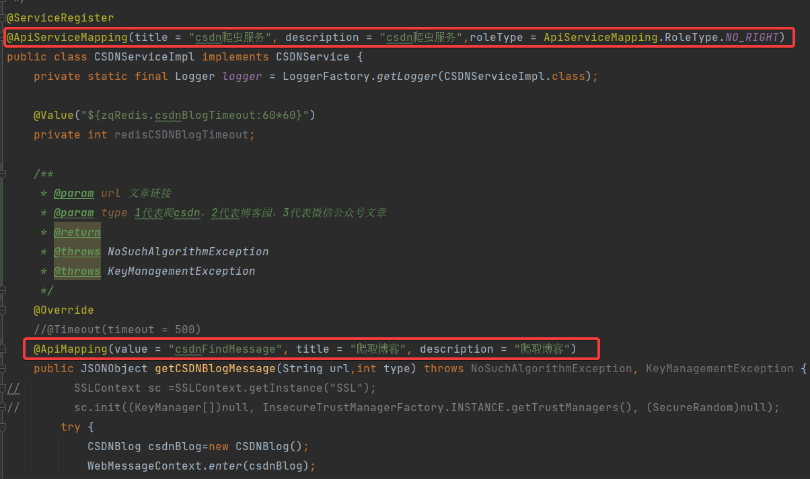
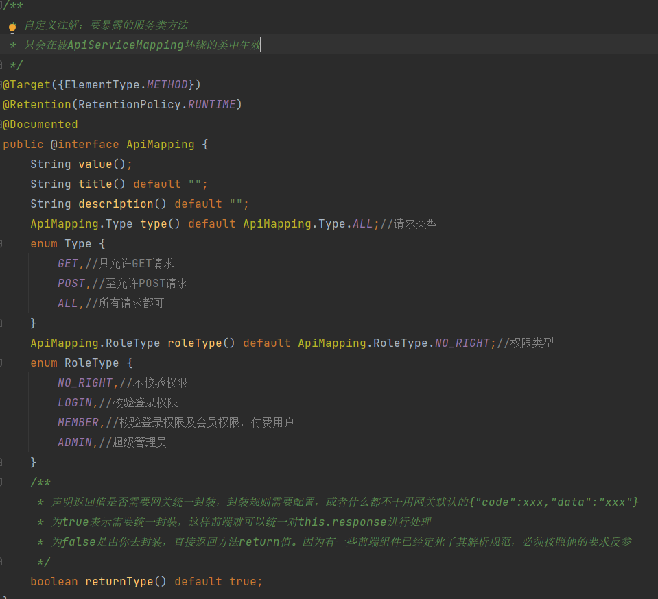
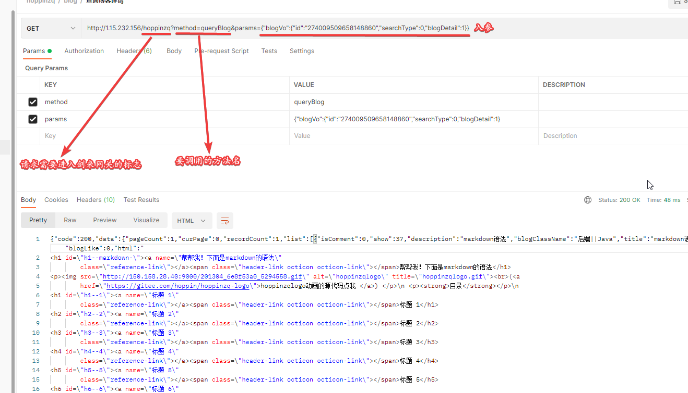
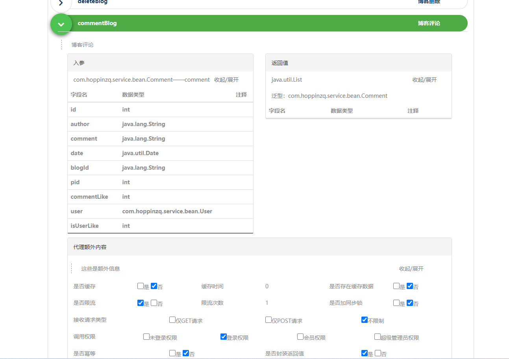
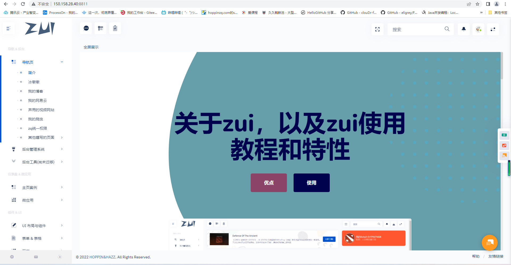

# hoppinzq.com的后台框架————剑来！

([hoppinzqlogo动画的源代码点我](https://gitee.com/hoppin/hoppinzq-logo))

#### 当你滑到剑来框架的时候，我感觉一切都是值得的，因为我相信，比起你的项目经历，没有什么比开发过一整套后端框架，开发过中间件，甚至是开发了一整套sso系统更能打动面试官的了。有人可能会质疑专业性，说这个代码可能不太行。我觉得，做比说能难能可贵，尤其是我用这套框架完成一个博客系统。博客系统确实有点low，但是你会发现，这套博客系统的设计跟传统的后台博客项目有多么的与众不同。

------------
> 须知：本框架跟我写的博客后台，爬虫后台，zui，都放在一个开源的项目下了，博客后台作为本框架的demo，具有一定的检验框架的健壮性和学习意义。

## 模块介绍：
### hoppinzq-common：剑来框架的公共模块；
### hoppinzq-client：剑来框架的客户端，相当于rpc的调用方，如要调用通过剑来rpc注册的服务，必须引入该模块（或jar包），通过ServiceProxyFactory 类里的方法，创建要调用的服务接口代理对象并缓存。在本地调用时，由代理类去拦截此次调用，通过zq协议向服务提供方请求。（具体配置项见博客项目配置文件）
### hoppinzq-service：剑来框架的服务端，相当于rpc服务提供者。如要注册自己写好的服务，必须引入该模块（或jar包），通过为服务类添加@ServiceRegister 注解来注册服务。（具体配置项见博客项目配置文件）

### hoppinzq-core：剑来框架的注册中心，该模块为一个单独的springBoot项目，如你的项目要引入hoppinzq-service模块来注册服务，必须指定注册中心的地址（通过配置文件），那么项目的服务就可以被“注册”到注册中心。就能被其他调用者“发现”。
> **博客演示项目的注册中心：[http://150.158.28.40:8801/service](http://150.158.28.40:8801/service)**

------------

## 中间件模块
### hoppinzq-auth：这个应该不算模块，是我写的一个独立的sso单点登录系统（需要单独部署，配置项参照该模块），页面可先访问：[http://150.158.28.40:8804/login.html](http://150.158.28.40:8804/login.html)。介绍的[博客点我](https://blog.csdn.net/qq_41544289/article/details/123065919 "博客点我")。这套系统其实也可以作为一个开源项目了，但是我懒得拆分了，就放在一起了。简单介绍一下：
> **Q：为什么要做这套单点登录系统？**
A：如你所见，这里有两个项目：blog和zui，我还有另外一个视频项目，分别部署在我的三台云服务器上。但是这三个项目我只希望用一套单点登录系统，zauth应运而生。

------------

> **Q: zauth都有什么功能？**
A：1、支持服务不同域：即该服务跟其他项目部署后不在同一个IP下，zauth通过签发一次性ucode解决跨域问题。
&nbsp;&nbsp;&nbsp;&nbsp;&nbsp;&nbsp;2、支持邮箱注册，手机号注册。支持第三方登录（目前集成的有微博跟gitee登录）
&nbsp;&nbsp;&nbsp;&nbsp;&nbsp;&nbsp;3、剑来网关和zjax支持（[zjax是我的开源项目，访问点我](https://gitee.com/hoppin/hoppinzq-jquery-zjax "zjax是我的开源项目，访问点我")），其他功能看博客和上面页面里的介绍，就不说了。

------------

### hoppinzq-gateway：剑来网关，我发誓这个中间件是我的项目的精华，首先你要使用hoppinzq-auth提供的服务，不仅需要你的业务模块通过hoppinzq-client调用之，还需要该网关模块提供鉴权。有人就会说：模块之间耦合性这么高吗？其实剑来网关已经做了解耦，可参照[我的这篇博客](http://1.15.232.156/blog/275579498257235970 "我的这篇博客")。在这里也稍微介绍一下：
##### 1、项目引入该模块，需要在启动项使用注解@EnableGateway（如果嫌这个注解的名字太通用，修改[这个aop类](https://gitee.com/hoppin/hoppinzq/blob/master/hoppinzq-gateway/src/main/java/com/hoppinzq/service/aop/annotation/EnableGateway.java "这个aop类")）开启网关，第二种自定义网关的方式在上面博客有介绍：

##### 2、通过注解@ApiServiceMapping和注解@ApiMapping为网关注册类和方法，以方便做映射。

]
##### 3、注解参数

##### 4、调用格式(以Get请求为例，同样支持POST和文件上传)：

##### 5、通过内置zwagger查看接口，[zwagger可访问](http://1.15.232.156/zwagger.html "zwagger可访问")：

##### 6、能做什么？自动分发请求，日志，缓存，限制请求，接口鉴权，幂等，同步锁，限流，加解密，返回值封装，超时机制等等一系列功能，之后我将单独开源一个项目详细介绍。

------------

### hoppinzq-javaagent：监控模块，已迁移到我的这个开源项目。
### hoppinzq-redis：redis模块，引入该模块就可以用redis。
### hoppinzq-webSocket：websocket模块，为zui添加聊天功能的模块，已迁移到我的这个开源项目。

------------

## 业务模块：
### hoppinzq-blog：使用剑来框架的博客模块，需要单独部署，有博客草稿自动缓存，线程池展示首页，lucene搜索等功能，核心功能是完备的，支持两种富文本编辑器及markdown编辑器，也可以通过爬虫来爬其他网站的博客到我这里。[首页可点击](http://1.15.232.156/ "首页可点击")

### hoppinzq-extra：额外模块，需要单独部署，就是乱七八糟的服务，其他模块必须通过hoppinzq-client来调用其提供的服务，目前有切词，语音转文字，文字转语音等服务。
### hoppinzq-webspider：爬虫服务，需要单独部署，其他模块必须通过hoppinzq-client来调用其提供的服务，目前支持爬CSDN，博客园和微信公众号文章。
### hoppinzq-zqui：zui介绍服务，需要单独部署，其实上面全是页面，待迁移至一个独立的开源项目，[可访问](http://150.158.28.40:8811/ "可访问")

# 其他待补充。。。